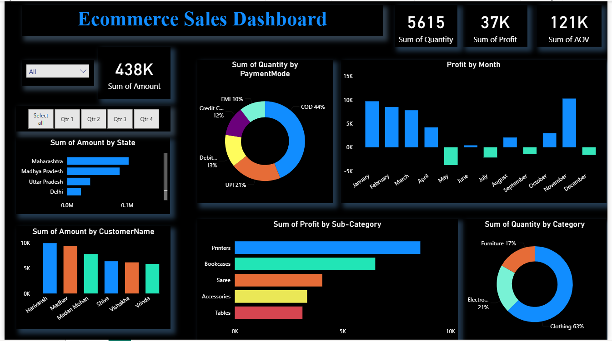
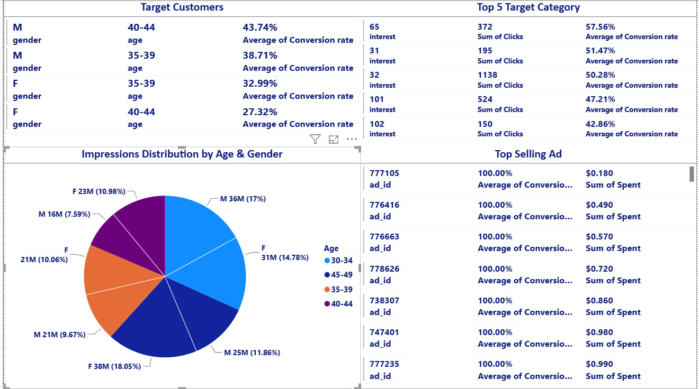
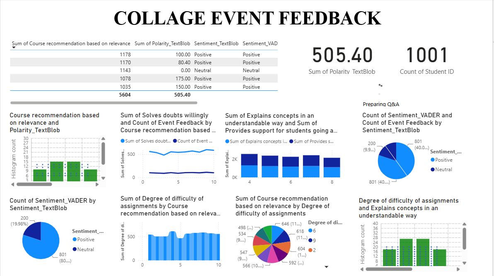

# 🚀 Data Analytics & Business Intelligence Portfolio

A comprehensive collection of Power BI analytics dashboards developed across retail e-commerce, digital marketing, and academic domain datasets. Each project demonstrates end-to-end data modeling, DAX measures, interactive visualizations, and actionable business insights.

---

## 📂 Repository Structure
```
├── Task-1/
│   ├── Ecommerce Sales Dashboard.pbix
│   └── task1_preview.png
├── Task-2/
│   ├── SocialMedia Ad Campaign.pbix
│   └── task2_preview.png
├── Task-3/
│   ├── Student Feedback Dashbord.pbix
│   └── task3_preview.png
└── README.md 
```
🛒 Task 1: E-commerce Sales Performance Dashboard
📌 Overview
An interactive sales and revenue analytics dashboard to evaluate multi-channel retail performance, profitability metrics, and regional customer purchasing patterns.
## 📸 Dashboard Preview


🎯 Key Performance Indicators (KPIs)
Total Sales & Net Revenue: Aggregate revenue generated across product lines.

Profit Margin %: Profitability tracking measured against standard cost targets.

Average Order Value (AOV): Mean transaction ticket size per customer.

Return Rate %: Product return tracking across merchandise categories.

💻 Key DAX Measures
Code snippet
// Total Sales
Total Sales = SUM('Sales'[Sales_Amount])

// Profit Margin %
Profit Margin % = 
DIVIDE(
    [Total Sales] - SUM('Sales'[Cost_Amount]), 
    [Total Sales], 
    0
)
📱 Task 2: Social Media Ad Campaign Analytics Dashboard
📌 Overview
A digital marketing intelligence dashboard designed to measure paid media efficiency, audience reach, conversion funnels, and Return on Ad Spend (ROAS) across social advertising channels.



🎯 Key Performance Indicators (KPIs)
Total Ad Spend & Impressions: Total budget deployed and audience impressions achieved.

Click-Through Rate (CTR %) & CPC: Engagement and traffic cost-efficiency.

Conversion Rate %: Percentage of ad clicks resulting in successful actions/leads.

Return on Ad Spend (ROAS): Revenue generated per unit of advertising spend.

💻 Key DAX Measures
Code snippet
// Click-Through Rate (CTR %)
CTR % = 
DIVIDE(
    SUM('Ad_Performance'[Clicks]), 
    SUM('Ad_Performance'[Impressions]), 
    0
)

// Return on Ad Spend (ROAS)
ROAS = 
DIVIDE(
    SUM('Ad_Performance'[Conversion_Value]), 
    SUM('Ad_Performance'[Spend]), 
    0
)
🎓 Task 3: Student Feedback & Academic Performance Dashboard
📌 Overview
An institutional performance dashboard built to analyze student satisfaction scores, faculty evaluation ratings, syllabus clarity, and campus resource feedback across departments.



🎯 Key Performance Indicators (KPIs)
Total Responses: Total survey submissions recorded.

Average Overall Satisfaction: Composite rating score across academic parameters.

Teaching Quality & Faculty Benchmark: Faculty evaluation index compared against academic quality standards.

Infrastructure Rating: Satisfaction tracking for labs, library, and support services.

💻 Key DAX Measures
Code snippet
// Average Feedback Rating
Average Rating = AVERAGE('Student_Feedback'[Overall_Rating])

// Positive Feedback % (Ratings >= 4 out of 5)
Positive Feedback % = 
DIVIDE(
    CALCULATE(COUNTROWS('Student_Feedback'), 'Student_Feedback'[Overall_Rating] >= 4),
    COUNTROWS('Student_Feedback'),
    0
)
🛠️ Tools & Technologies Used
Business Intelligence: Microsoft Power BI Desktop

Calculations & Data Modeling: DAX (Data Analysis Expressions), Star Schema

ETL & Transformation: Power Query Editor

Version Control: Git & GitHub
